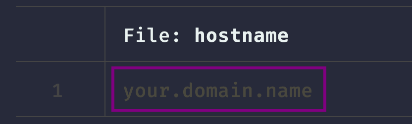
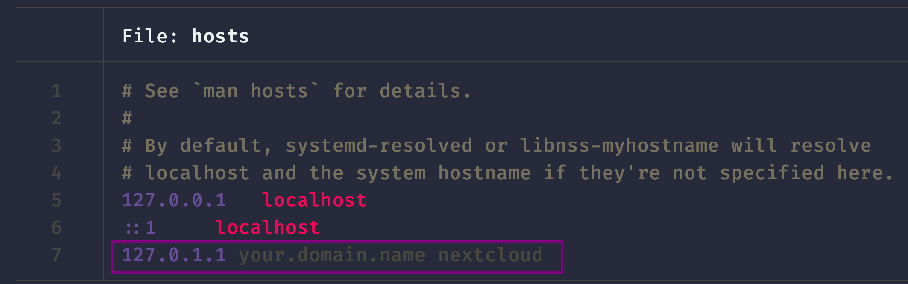
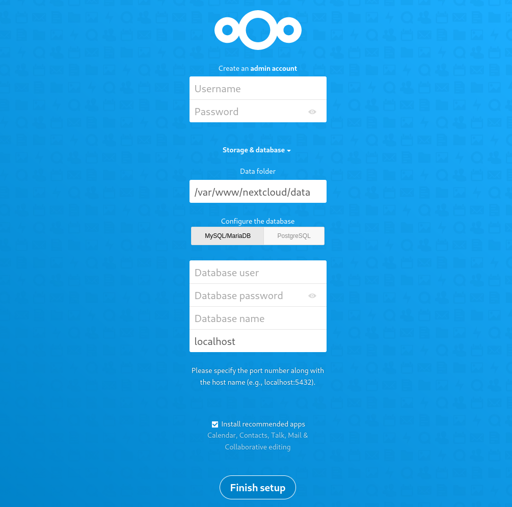
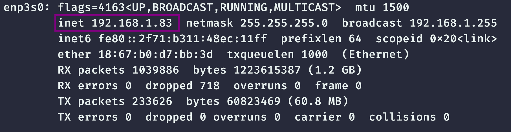
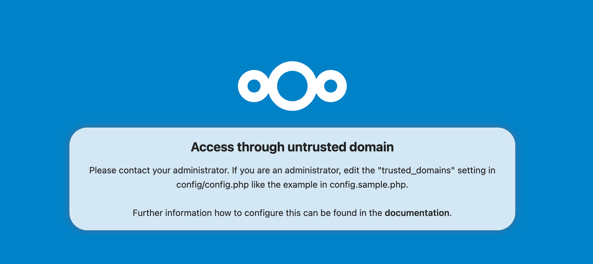
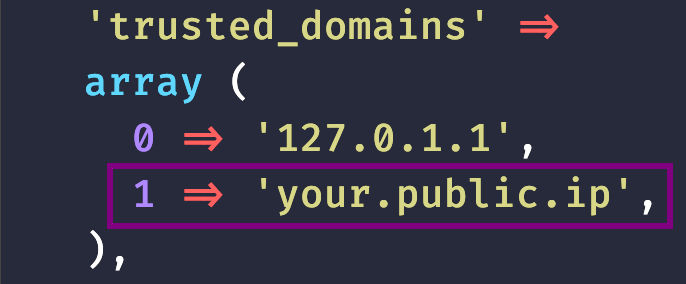
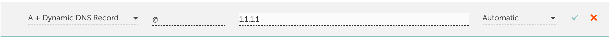
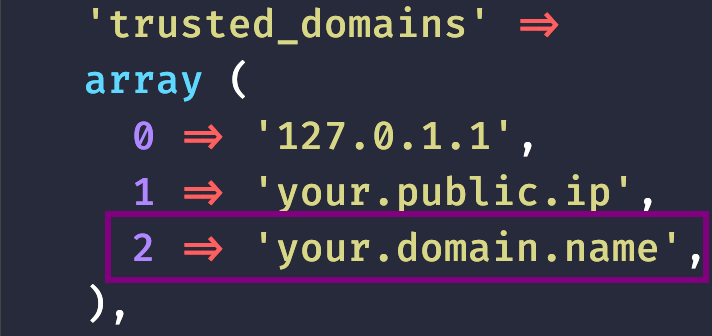

# Make your own self-hosted cloud storage
## Benefits
- More privacy and security
- Cost-Effectiveness
- Scalability
- More Control and Customisation

## Prerequisites
- Own a computer that could run Linux (x86_x64)
- Check if your ISP allows you to enable port-forward [Optional]
- Own a domain [Optional]

## Initial server setup
#### Update your archlinux distribution
```Bash
sudo apt update
sudo apt full-upgrade
sudo apt autoremove
```
- Install all necessary packages (some may be optional based on your requirements)
```bash
sudo apt install neovim wget mariadb-server php php-apcu php-bcmath php-cli php-common php-curl php-gd php-gmp php-imagick php-intl php-mbstring php-mysql php-zip php-xml unzip nmap
```

#### Update your hostname (Optional)
- Modify the file and assign an appropriate hostname or domain name to your server

```bash
sudo nvim /etc/hostname
```

```bash
sudo nvim /etc/hosts
```

+ Restart your server to apply the changes made thus far

```bash
sudo reboot
```

### Downloading Nextcloud
+ Download the Nextcloud ZIP file
```bash
wget https://download.nextcloud.com/server/releases/latest.zip
```
### MariaDB Setup
+ Check the status of the `mariadb` service
```bash
systemctl status mariadb
```
+ Run the secure installation script
```bash
sudo mysql_secure_installation
````
- Then you should a several question. Answer following the provided input below
```
Password prompt --> Click Enter key
Switch to unix_socket_auth [Y/n] --> n
Change the root password [Y/n] --> Y
Enter your secure password: 
Remove anonymous users [Y/n] --> Y
Disallow root login remotely [Y/n] --> Y
Remove test database and access to it [Y/n] --> Y
Reload privileges tables now [Y/n] --> Y
```

### Setting up the Nextcloud Database
+ Access to MariaDB
```bash
sudo mariadb
```
- Create the database
```sql
CREATE DATABASE nextcloud;
```
+ Set-up permissions
```sql
GRANT ALL PRIVILEGES ON nextcloud.* TO 'nextcloud'@'localhost' IDENTIFIED BY 'mypassword';
  
FLUSH PRIVILEGES;
```
+ Press CTRL+D to exit

### Apache WebServer

+ Enable these PHP extensions

```bash
sudo phpenmod bcmath gmp imagick intl
```
+ Unzip the Nextcloud file

```bash
unzip latest.zip
```
+ Move the files to the serving location and set the appropriate permissions

```bash
mv nextcloud your.domain.name
```
+ Change permissions

```bash
sudo chown -R www-data:www-data your.domain.name
```
+ Move the directory to /var/www

```bash
sudo mv your.domain.name /var/www
```
- Disable the default site for apache

```bash
sudo a2dissite 000-default.conf
```

### Configure Nextcloud host
- Create an Apache config file for serving Nextcloud

```bash
sudo nvim /etc/apache2/sites-available/your.domain.name.conf
```

* Insert the provided content into the file, ensuring to modify the part that mentions 'your.domain.name'

```bash
<VirtualHost *:80>
    DocumentRoot "/var/www/your.domain.name"
    ServerName your.domain.name

    <Directory "/var/www/your.domain.name/">
        Options MultiViews FollowSymlinks
        AllowOverride All
        Order allow,deny
        Allow from all
   </Directory>

   TransferLog /var/log/apache2/your.domain.name_access.log
   ErrorLog /var/log/apache2/your.domain.name_error.log

</VirtualHost>  
```

* Enable the site

```bash
sudo a2ensite your.domain.name.conf
```

### PHP

+ You have to tweak certain lines in order to work nextcloud

```bash
sudo nano /etc/php/8.1/apache2/php.ini
```

+ Within the file, locate and modify these parameters

```php
memory_limit = 3G #(Increase the value if you have more RAM)
upload_max_filesize = 50G #(Increase/Decrease the value following your purposes)
max_execution_time = 3600
post_max_size = 50G #(Increase/Decrease the value following your purposes)
date.timezone = Europe/London #(View the link below to adjust your timezone)
opcache.enable=1
opcache.interned_strings_buffer= 128
opcache.max_accelerated_files=10000
opcache.memory_consumption=128
opcache.save_comments=1
opcache.revalidate_freq=1
```

[Timezones](https://www.php.net/manual/en/timezones.php)

+ Enable PHP mods for Apache

```bash
sudo a2enmod dir env headers mime rewrite ssl
```

+ Restart Apache

```bash
sudo systemctl restart apache2
```

### Set-up Nextcloud web server

- When you first enter the page you should see something like this

- Enter the following information into the respective boxes
```txt
Username --> Your Username
Password --> Set a secure password to login into Nextcloud

Data Folder --> Leave as default

Database user --> nextcloud
Database password --> nextcloud_db password
Database name --> nextcloud
```

+ Then, Install the recommended apps

### ***Optional***

+ As mentioned earlier, to establish a connection to your Nextcloud from outside your private network, you need to enable port forwarding on your router
+ In order to proceed, in this example, I configure my port forwarding on a Movistar router
+ The first thing you need to do is search for your private IP using the following command

```bash
ifconfig -a
```



+ Next, enter your router portal to configure the port forwarding. Enter the IP address and select 'web-server' at port 80, then enable it
+ To check if your port 80 is open, run the following command

  ```bash
  sudo nmap -n -PN -sT -sU -p80 {IP}
  ```
+ Check if the nextcloud page is accessible typing your public IP on the web browser
  - You should see something like this




#### *Extra*
- If you want to access to your nextcloud through your public IP 
+ Edit ```config.php```

  ```bash
  sudo nvim /var/www/your.domain.name/config/config.php
  ```
+ On trusted_domains add your public IP
  


#### Configure your domain

- Initially, you require a domain, which can be either purchased or obtained for free
- Several websites provide affordable domain options
  	- [Namecheap](https://www.namecheap.com)
  	- [Cloudflare](https://www.cloudflare.com)
  	- [Squarespace](https://domains.squarespace.com)
  	- [Name.com](https://www.name.com)

#### Set-up namecheap
- Once you've acquired a domain, proceed to the Advanced DNS settings and establish a host record
- In the ```IP Address``` section, input your public IP address
- Then, on the ```HOST``` section put "@"
  
- Proceed to edit the `config.php` file

```Bash
sudo nvim /var/www/your.domain.name/config/config.php
```

- Add your domain name to the `trusted_domains` array


+ Now, you can access your Nextcloud through your domain

### TLS certificate

+ Install snapd

```bash
git clone https://aur.archlinux.org/snapd.git
cd snapd
makepkg -si
sudo systemctl enable --now snapd.socket
sudo ln -s /var/lib/snapd/snap /snap
```

+ Install certbot

```bash
sudo snap install --classic certbot
sudo ln -s /snap/bin/certbot /usr/bin/certbot
```

+ Get and install your certificates

```bash
 sudo certbot --apache
```

## Troubleshooting
- For troubleshooting, search the internet. Most forums typically have solutions
- I case that you don't know how to solve the problem. Please feel free to contact me via [email](mailto:gerardo.vallejosc@usm.cl)

## Resources
- [Nextcloud Documentation](https://docs.nextcloud.com/)
- [Nextcloud Community](https://help.nextcloud.com/)
	- Feel free to ask anything, is a wonderful community

**In case of any errors or suggestions, please submit a pull request**
